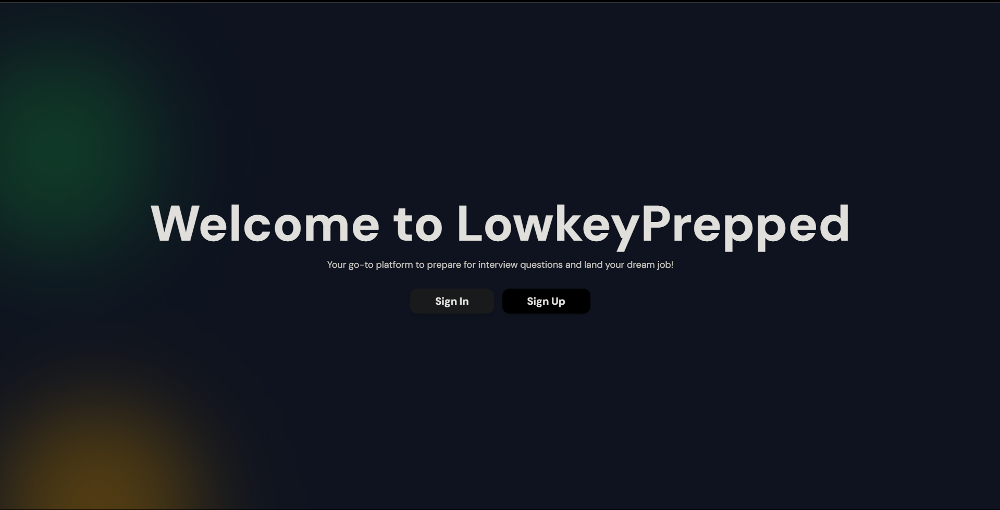
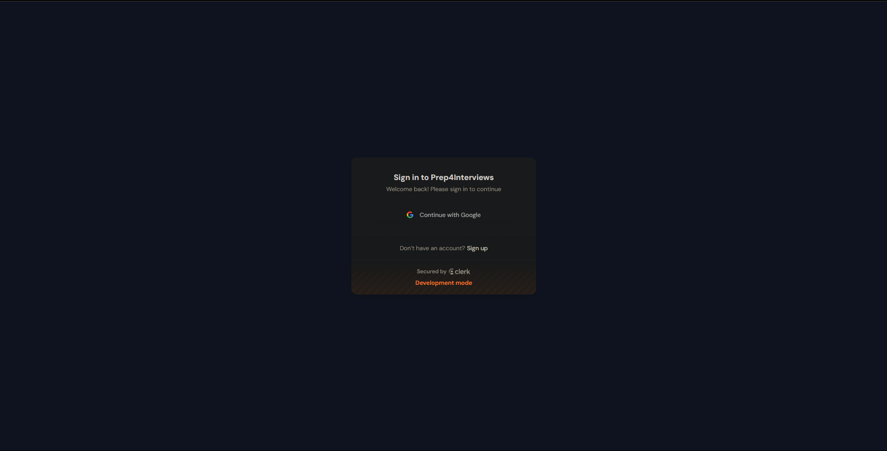
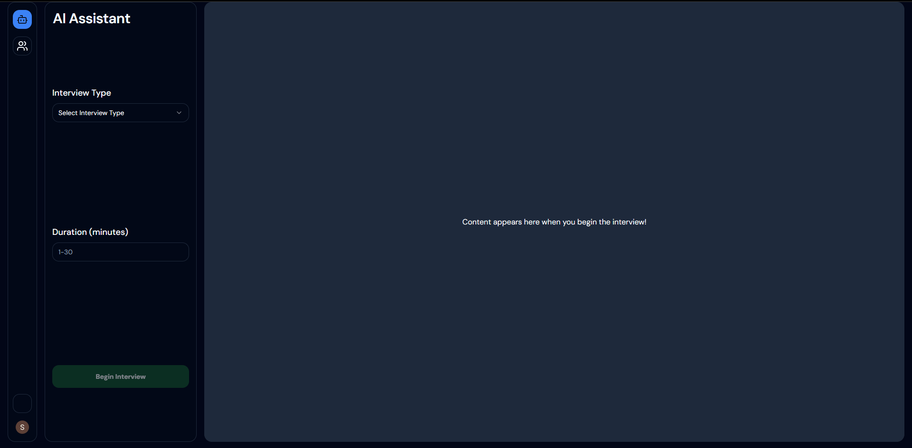
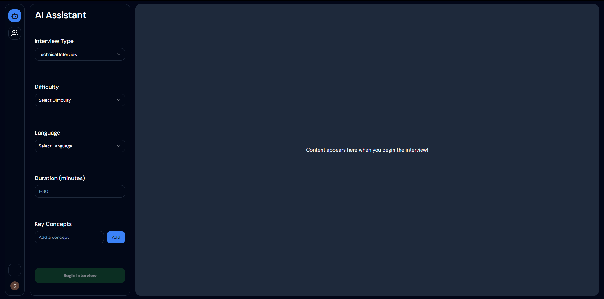
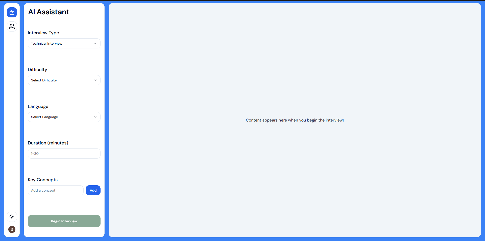
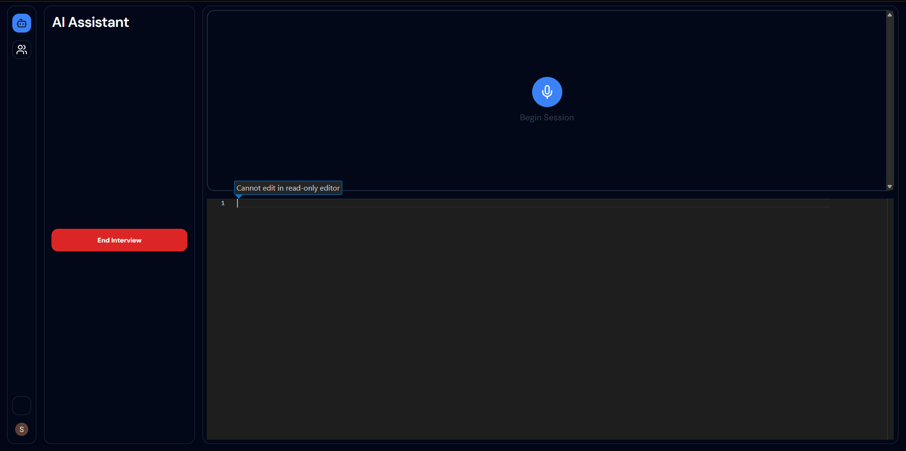
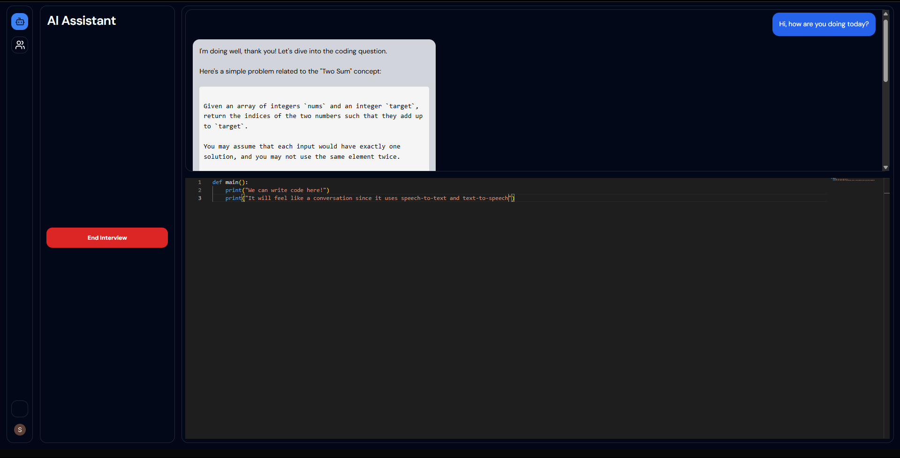
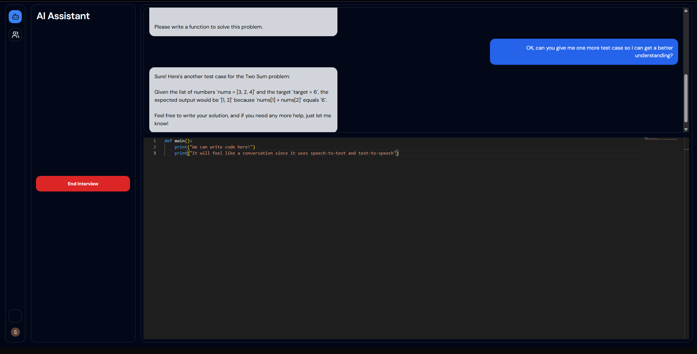
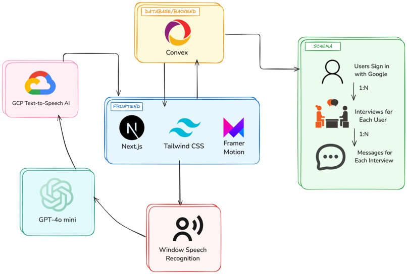

# LowkeyPrepped 🚀

LowkeyPrepped redefines interview preparation with an AI-powered mock interview platform designed specifically for software engineers. It’s not just another practice tool; it’s a personalized coaching experience that delivers realistic mock interviews covering both technical and behavioral aspects.

Our conversational AI simulates real-world interview scenarios, providing:
- 💬 Instant feedback on responses
- 🎯 Highlighting areas for improvement
- 🤖 Guidance when a user gets stuck

Technical interviews are challenging, but LowkeyPrepped breaks them down, helping users tackle everything from coding questions to system design.

Check out our project on [Devpost](https://devpost.com/software/lowkeyprepped).

---

## Features ✨

### Frontend 🖥️
- ⚛️ **Next.js** with **React** for a responsive and dynamic user interface
- 🎨 **TailwindCSS** for efficient, customizable styling
- 🎥 **Framer Motion** for smooth animations

### Backend 🔧
- 🗄️ **Convex and Clerk** for user authentication, database management and backend logic (used webhooks to connect the two tools!)
- 🤖 **OpenAI GPT-4** mini for conversational AI and interview question generation
- 🎤 **Windows Speech Recognition** for speech-to-text transcription during interviews
- 🔊 **Google Text-to-Speech API** for converting responses into audible feedback

---

## How to Use 🛠️

To get started with **LowkeyPrepped**, you need to configure your environment and API keys.

1. **Create a `.env.local` file** at the root of your project. You will need to add your API keys here.
   - Follow just the first two steps to get the API keys in this [tutorial](https://clerk.com/docs/quickstarts/nextjs)
   - Follow this [tutorial](https://docs.convex.dev/auth/clerk) to obtain your own Convex API keys.
   - Additionally, get your **Google Text-to-Speech API key** by following [this guide](https://cloud.google.com/text-to-speech/docs/before-you-begin).

2. Your `.env.local` file should look something like this:
    ```
    # Deployment used by `npx convex dev`
    CONVEX_DEPLOYMENT=YOUR_KEY
    
    NEXT_PUBLIC_CONVEX_URL=YOUR_KEY
    
    NEXT_PUBLIC_CLERK_PUBLISHABLE_KEY=YOUR_KEY
    
    CLERK_SECRET_KEY=YOUR_KEY
    
    CLERK_WEBHOOK_SECRET=YOUR_KEY
        
    NEXT_PUBLIC_OPENAI_API_KEY=YOUR_KEY
    
    NEXT_PUBLIC_GROQ_API_KEY=YOUR_KEY
    
    NEXT_PUBLIC_GROQ_API_URL=YOUR_KEY
    
    NEXT_PUBLIC_GOOGLE_CLOUD_API_KEY=YOUR_KEY
    ```

3. Install the necessary packages by running:
    ```bash
    npm install
    ```

4. To start development, run the following commands:
  - Start the development server:
    ```bash
    npm run dev
    ```
  - Start the Convex database:
    ```bash
    npx convex dev
    ```

5. Now you’re ready to start building and running LowkeyPrepped locally!

---

## Screenshots 📸

| Screenshot 1 | Screenshot 2 |
|--------------|--------------|
|  |  |
|  |  |
|  |  |
|  |  | |

---

## Architecture 🛠️



---

## Contributors 💻
| Sagar Patel                 | Eric Zhou                   | Hannah Lee                |
|-----------------------------|-----------------------------|---------------------------|
|  |  |  |
| [sagarpatel211](https://github.com/sagarpatel211) | [ezhou84](https://github.com/ezhou84) | [hannahstarlee](https://github.com/hannahstarlee) |
---
